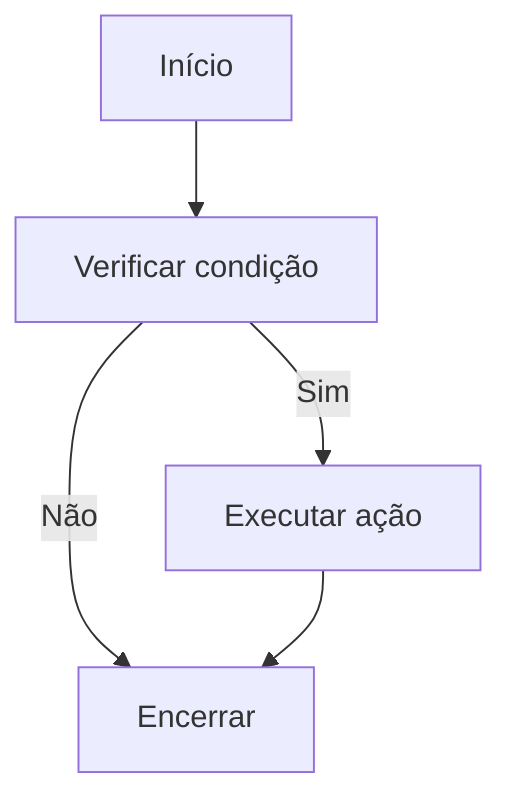

# BOOTSTRAP - CONCEITOS

## O QUE PRECISA USAR:

<p align="justify">Para começar entre no site do <strong>BOOSTRAP</strong> para pegar o link para o <strong><em>CSS e JS</em></strong> deles para ser utilizado em seu projeto</p>

caso tenha preguiça segue o **TEMPLATE**: <br> <br>

<center><strong>TEMPLATE</strong></center> <br>

```html
<!doctype html>
<html lang="pt-BR">
  <head>
    <meta charset="utf-8">
    <meta name="viewport" content="width=device-width, initial-scale=1">
    <title>Bootstrap</title>
    <link href="https://cdn.jsdelivr.net/npm/bootstrap@5.3.3/dist/css/bootstrap.min.css" rel="stylesheet" integrity="sha384-QWTKZyjpPEjISv5WaRU9OFeRpok6YctnYmDr5pNlyT2bRjXh0JMhjY6hW+ALEwIH" crossorigin="anonymous">
  </head>
  <body>
    <h1> </h1>
    <script src="https://cdn.jsdelivr.net/npm/bootstrap@5.3.3/dist/js/bootstrap.bundle.min.js" integrity="sha384-YvpcrYf0tY3lHB60NNkmXc5s9fDVZLESaAA55NDzOxhy9GkcIdslK1eN7N6jIeHz" crossorigin="anonymous"></script>
  </body>
</html>
```

<p align="justify">Logo depois podemos partir para as classes de estilo do <strong>BOOSTRAP</strong></p>

## CLASSES DE ESTILOS (Básico):

- `container`: cria uma caixa responsiva (*por padrão*) alem de dar um padding-left e right para ambos os lados, centralizando o elemento (**apenas**) no centro. <br>

- `container-fluid`: é diferente do anterior, ele ajusta o elemento a <ins>100% da <strong>área</strong></ins> que ele está sendo aplicado (sempre no elemento pai). <br>

- `pt` com esse comando você controla o padding da página para o lado superior (**padding-top**). veja alguns exemplos: <br>

  - `pt-5` adiciona 5 padding-top <br>
  
  - `p-5`adicona 5 padding em todas as direções <br>

- `m` essa clase define a margin de um elemento, mesmo esquema do padding (*p*) acima <br>

- `border` adiciona uma borda ao elemento (<ins>lembrando que ela pode mudar depedendo do template que está utilizando, o comando e o mesmo</ins>).

  - `border-` insira logo depois a cor desejada para a borda

- `bg-` esse comando modifica a cor de fundo de um elemento aonde a classe foi inserida, veja algumas cores:
  - `bg-dark` cor preta (#000000) <br>

  - `bg-primary` cor azul (#036DFE) <br>

- `text` com essa classe você muda a cor do texto e a posição do mesmo no elemento, veja exemplos: <br>

  - `text-white` texto branco <br>

  - `text-center` texto centralizado <br>

### Container
```text
.container-sm  100% 540px 720px 960px 1140px 1320px
.container-md  100% 100%  720px 960px 1140px 1320px
.container-lg  100% 100%  100% 960px 1140px 1320px
.container-xl  100% 100%  100% 100% 1140px 1320px
.container-xxl 100% 100%  100% 100% 100% 1320px
```

Caso queira informações melhores, veja a imagem abaixo tirado do curso de Boostrap do canal CFB Cursos:


### Grid

Caso queira fazer uma grid o bootstrap pode te ajudar nisso, veja o exemplo abaixo de uma linha com 3 colunas:
```html
<div class="row border">
  <div class="col border">Coluna 1</div>
  <div class="col border">Coluna 2</div>
  <div class="col border">Coluna 3</div>
</div>
```

> <strong>col = Coluna | row = Linha</strong>.

> [!NOTE]
> E possivel utilizar os parametros do container nos col, também e utilizavel usar números `col-1, col-2, col-3`

### Imagem

Caso queira mexer com imagens também e possível com bootstrap, veja como deixar uma foto quadrada circular
```html

```

### Botões

Estilizar botões e algo muito simples, veja alguns botões

- `btn-primary` deixa o botão com fundo azul
- `btn-secondary` deixa o botão cinza
- `btn-succes` deixa o botão verde
- `btn-info` deixa o botão azul agua/ciano
- `btn-warning` deixa o botão amarelo
- `btn-danger` deixa o botão vermelho
- `btn-dark` deixa o botão preto
- `btn-light` deixa o botão cinza claro
- `btn-link` deixa o botão com caractericas de ser algo clicavel (*link*)
- `btn-outline` muda o botão quando o usuário passa o mouse em cima
- `btn-group` cria um grupo de botões, essa classe deve ser pai dos outros botões




